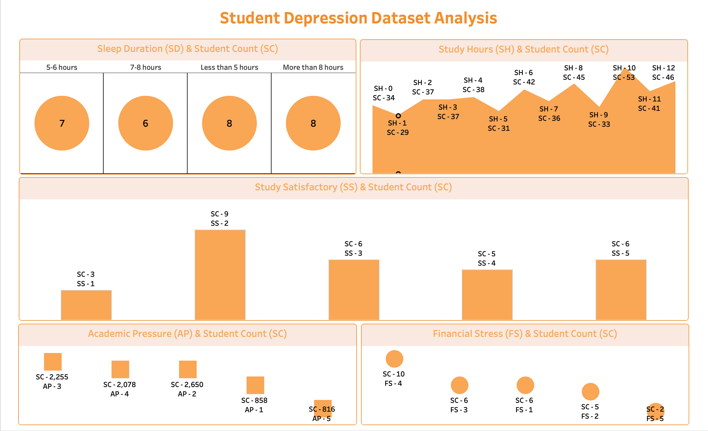
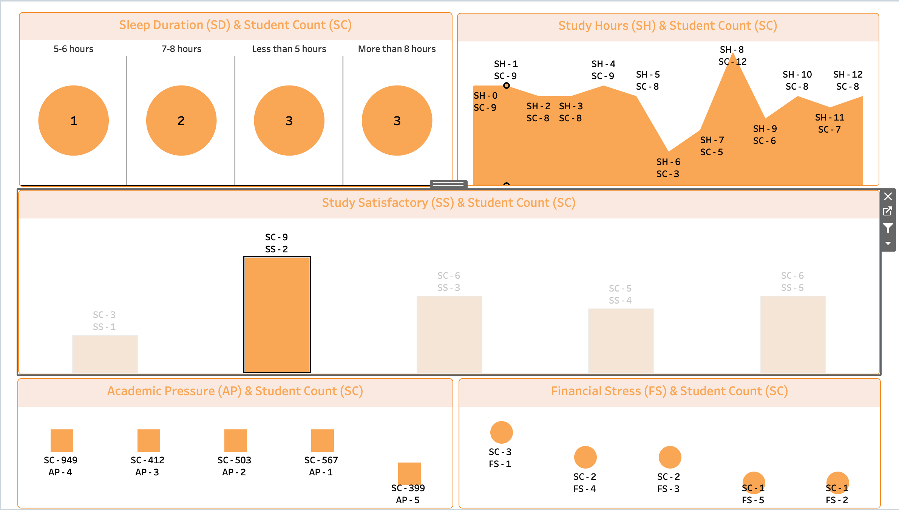
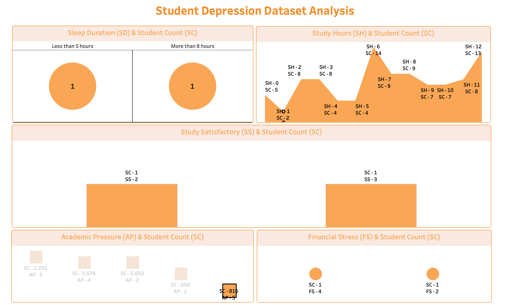

# Student Depression Dataset Analysis

A Tableau-based analysis of a student mental health dataset focused on understanding how academic pressure, financial stress, study satisfaction, sleep duration, and study hours relate to reported depression.

## Project Objective

The goal of this project is to:

- Explore the student depression dataset in a structured way
- Clean and standardize the raw data before visualization
- Build an interactive Tableau dashboard for quick trend analysis
- Highlight the main factors associated with student well-being

## Tech Stack

| Tool | Purpose |
| --- | --- |
| MySQL | Data cleaning, column standardization, and exploratory SQL analysis |
| Tableau Desktop / Tableau Public | Dashboard development and interactive visual storytelling |
| CSV | Source dataset and cleaned analysis dataset |
| `.twbx` | Packaged Tableau workbook containing the dashboard and extract |

## Repository Structure

```text
Student Depression Dataset Analysis/
├── Data/
│   ├── Depression+Student+Dataset.csv
│   └── StudentDepressionTableau.csv
├── Sql/
│   └── StudentDepressionTableau.sql
├── Tableau/
│   ├── Student Depression Dataset Analysis.twbx
│   └── Screenshots/
│       ├── Dashboard1.png
│       ├── Dashboard2.png
│       └── Dashboard3.png
└── README.md
```

## Dataset Overview

The analysis uses a student depression dataset with the following fields:

- `gender`
- `age`
- `academic_pressure`
- `study_satisfaction`
- `sleep_duration`
- `dietary_habits`
- `suicidal_thoughts`
- `study_hours`
- `financial_stress`
- `family_history_of_mental_illness`
- `depression`

The cleaned Tableau-ready dataset also includes:

- `Age_Group`
- `index_col`

## Data Preparation

The SQL script in [`Sql/StudentDepressionTableau.sql`](Sql/StudentDepressionTableau.sql) was used to prepare the data for analysis. The main steps include:

- Creating the analysis database
- Standardizing gender values from `Male` and `Female` to `M` and `F`
- Checking for null or blank values
- Creating an `Age_Group` column
- Grouping ages into ranges:
  - `A1` for ages 18 to 24
  - `A2` for ages 25 to 30
  - `A3` for all other ages
- Renaming and changing column datatypes for Tableau compatibility
- Adding an auto-increment `index_col` for charting and counting
- Running exploratory `COUNT` queries across the main fields

## Dashboard Design

The Tableau workbook in [`Tableau/Student Depression Dataset Analysis.twbx`](Tableau/Student%20Depression%20Dataset%20Analysis.twbx) contains a single dashboard built from five sheets:

| Sheet | Title | Visual Type | Focus |
| --- | --- | --- | --- |
| Sheet 1 | Academic Pressure (AP) & Student Count (SC) | Square marks | Relationship between academic pressure and student count |
| Sheet 2 | Financial Stress (FS) & Student Count (SC) | Circle marks | Relationship between financial stress and student count |
| Sheet 3 | Study Satisfactory (SS) & Student Count (SC) | Automatic marks | Relationship between study satisfaction and student count |
| Sheet 4 | Sleep Duration (SD) & Student Count (SC) | Pie chart | Distribution of sleep duration across students |
| Sheet 5 | Study Hours (SH) & Student Count (SC) | Area chart | Distribution of study hours across students |

The dashboard is designed with interactive filtering so users can compare different student-life factors in a single view.

## Dashboard Screenshots

### Snapshot 1



### Snapshot 2



### Snapshot 3



## How To View The Project

1. Open the SQL script in your MySQL client if you want to review the data preparation steps.
2. Open [`Tableau/Student Depression Dataset Analysis.twbx`](Tableau/Student%20Depression%20Dataset%20Analysis.twbx) in Tableau Desktop or Tableau Reader.
3. Browse the dashboard and use the filters/actions to explore the relationships between the variables.
4. Review the screenshots in [`Tableau/Screenshots/`](Tableau/Screenshots/) for a quick preview.

## Notes

- The workbook is packaged as a `.twbx`, so the data extract is bundled with it.
- The SQL script reflects the transformation logic used to make the data Tableau-ready.
- If you want, you can extend the workbook by adding more segmentation views such as age group, gender, or depression status.

